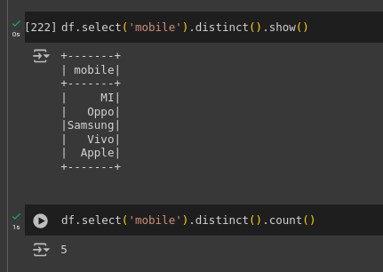
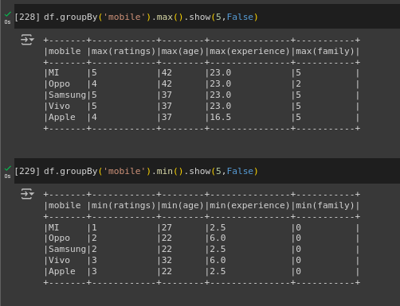
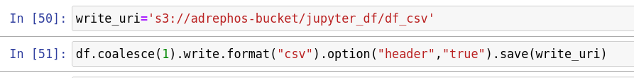

# ST0256 Tópicos Especiales en Telemática

## Estudiante:
- Nombre: Juan Esteban Avendaño Castaño
- Correo: jeavendanc@eafit.edu.co

## Profesor:
- Nombre: Álvaro Ospina
- Correo: aeospinas@eafit.edu.co

# Reto 7 - Spark

## Spark en Colab
### Configuración
Primero instalamos las librerías necesarias para trabajar con Spark
y montamos el Google Drive:

Creamos la SparkSession y el SparkContext para trabajar con Spark:

Verificamos que la SparkSession y el SparkContext se hayan creado correctamente:

Subimos la carpeta `datasets` a nuestro Google Drive:

Cargamos el dataset `sample_data.csv` a Spark:

Podemos verificamos que el dataset se haya cargado correctamente:

### Consultas
Mostar las primeras 5 filas del dataset:

Podemos seleccionar solo las columnas `age` y `mobile` del dataset:

Podemos hacer `describe` al dataset para ver las estadísticas de las columnas:

También se pueden usar tipos de datos de SQL para hacer consultas, se importan de la siguiente forma:

Se pueden usar por ejemplo para crear columnas con este tipo de datos y haciendo `cast` a las columnas del dataframe:

Al crear columnas podemos operar con los datos de las columnas del dataframe, por ejemplo sumando 10 a la columna `age` para crear una nueva columna `age_after_10_yrs`:

Se pueden tambien hacer filtros en el dataframe, deacuerdo a una condición, por ejemplo:

Otra consulta util es el `distinct` para ver los valores únicos de una columna, también se puede hacer `count` para contar los valores únicos:  

Se pueden hacer `groupBy` para agrupar los datos de una columna y hacer operaciones sobre ellos, por ejemplo contar cuantos celulares hay de cada marca:

Con `groupBy` también se pueden hacer operaciones más complejas, por ejemplo sumar o sacar  un promedio a los valores de cada columna agrupados por la columna `mobile`:

Con `groupBy`, `max` y `min` se pueden sacar los valores máximos y mínimos de una columna:

Usando `agg` y `groupBy` se pueden hacer operaciones más complejas, por ejemplo sumar los valores de la columna `experience` agrupados por la columna `mobile`:

Otra de las cosas que podemos hacer con Spark, es hacer uso de funciones ya sean las funciones típicas de python o funciones lambda:

Otro tipo de funciones que puede resultar utiles son las `User Defined Functions` de pandas que sirven para aplicar funciones a los datos de una columna:

Para terminar podemos hacer `drop` de columnas que no necesitemos en el dataframe, como por ejemplo duplicados:

### Subir datos a S3
Primero instalamos las librerías necesarias para trabajar con S3:

Configuramos las credenciales de AWS:

Subimos el archivo `df.csv` a S3:

Subimos el archivo `df.parquet` a S3:

Para terminar podemos ver los archivos subidos a S3:

## Spark en EMR con Jupyter
Primero ingresamos a Jupyter en EMR y creamos un nuevo notebook:

### Configuración
Primero importamos las librerías necesarias para trabajar con Spark, creamos la SparkSession, el SparkContext y leer el archivo `sample_data.csv` de S3:

Verificamos que se haya cargado correctamente el archivo y que el dataframe se haya creado:

### Consultas
Iguales a las realizadas en Colab.

### Subir datos a S3
Para subir los datos a S3 en formato `csv` se hace de la siguiente forma:

Para subir los datos a S3 en formato `parquet` se hace de la siguiente forma:

Para terminar podemos ver los archivos subidos a S3:

Archivo `csv`:

Archivo `parquet`:

## Conclusiones
- Spark es una herramienta muy poderosa para trabajar con grandes volúmenes de datos.
- Se pueden hacer consultas de forma muy similar a SQL.
- Se pueden hacer operaciones sobre los datos de forma muy sencilla.
